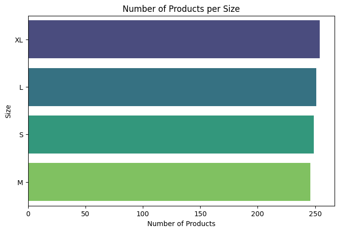

# 🕵️‍♀️ Laporan Proyek Machine Learning - Salsabila Mahiroh

---

## 💼 Domain Proyek : Rekomendasi Produk Fashion

Sistem  rekomendasi  telah  menjadi  bagian  yang  tak  terpisahkan  dari  hampir semua sistem  berbasis  informasi  serta e-commercepada  umumnya [1]. Sistem  pemberi  rekomendasi  berguna  untuk  memberikan rekomendasi  produk  yang  akan dipilih  berdasarkan  preferensi  masa  lalu,  riwayat pembelian,  dan  informasi  demografi [2]. Sistem rekomendasi banyak diterapkan dalam aplikasi e-commerce maupun media sosial, khususnya pada penjualan produk fashion seperti baju, sepatu, dan sebagainya, untuk meningkatkan bisnis serta memberikan rekomendasi produk kepada pengguna. Dalam membangun sistem rekomendasi, dibutuhkan pendekatan seperti Content-Based Filtering dan Collaborative Filtering. Pendekatan Collaborative filtering merupakan pendekatan yang memberikan  rekomendasi  atau prediksi  item  berdasarkan  pada  opini  pengguna-pengguna  yang mempunyai  kemiripan [3]. Sedangkan pendekatan Content-Based Filtering merupakan pendekatan yang digunakan untuk memberikan rekomendasi yang merekomendasikan item yang serupa dengan item yang telah disukai sebelumnya.

Pada proyek ini, sistem rekomendasi akan dibuat, khususnya pada penjualan produk fashion. Fokus utama sistem adalah memberikan rekomendasi produk seperti pakaian, sepatu, dan baju berdasarkan preferensi pengguna. Dengan memanfaatkan data interaksi pengguna dan informasi produk, sistem ini diharapkan dapat meningkatkan pengalaman berbelanja serta mendukung strategi pemasaran yang lebih personal. Proyek ini penting diselesaikan karena dapat meningkatkan kepuasan pengguna dan mendorong penjualan melalui rekomendasi yang relevan.

---

## 🔍 Business Understanding
👩🏽‍🔧 **Problem Statement**

1. Banyak pengguna kesulitan menemukan produk fashion yang sesuai dengan preferensi mereka karena banyaknya pilihan dan variasi produk seperti merek, kategori, warna, dan ukuran.
2. Pengguna sering tidak mengetahui produk lain yang mungkin disukai berdasarkan riwayat pembelian atau preferensi pengguna lain yang serupa.

👩🏽‍🔧 **Goal**

1. Membangun sistem rekomendasi yang dapat membantu pengguna menemukan produk fashion yang sesuai dengan preferensi mereka (seperti merek favorit, warna, ukuran, dan kategori produk).
2. Mengembangkan sistem rekomendasi yang mampu memberikan saran produk berdasarkan kesamaan dengan produk yang pernah disukai atau dibeli pengguna lain.

👩🏽‍🔧 **Solution Appoarch**

1. **Content-Based Filtering**: Menggunakan fitur seperti *Brand*, dan *Category*, untuk merekomendasikan produk yang mirip dengan produk yang disukai pengguna.
2. **Collaborative Filtering**: Menggunakan data *Rating* yang diberikan oleh pengguna untuk merekomendasikan produk berdasarkan pola preferensi pengguna lain yang memiliki selera serupa.

---

## 📁 Data Understanding
1. **Sumber dataset** : https://www.kaggle.com/datasets/bhanupratapbiswas/fashion-products
2. **Informasi dataset** : **Dataset Fashion Product**, berisi informasi tentang berbagai produk fashion yang dapat digunakan untuk membangun sistem rekomendasi, terutama di domain e-commerce fashion. Dataset ini cocok untuk use case seperti sistem rekomendasi produk berbasis konten, kolaboratif, maupun hibrida.
3. **Jumlah data** : Terdapat 1.000 data dan memiliki total 9 kolom, 5 untuk kolom kategori, dan 4 untuk kolom numerik 
4. **Kondisi data** :
- Tidak terdapat missing value
- Tidak terdapat data duplikat

### 🔗 Variabel pada Fasihon Product adalah sebagai berikut :
| **Nama Kolom**   | **Deskripsi Fitur**                                                                 |
|------------------|--------------------------------------------------------------------------------------|
| `User ID`        | ID unik dari pengguna yang memberikan rating pada produk.                           |
| `Product ID`     | ID unik dari produk fashion.                                                         |
| `Product Name`   | Nama produk fashion, seperti "Dress", "Shoes", "T-shirt", dll.                      |
| `Brand`          | Merek atau brand dari produk, seperti Adidas, H&M, Zara, dsb.                        |
| `Category`       | Kategori produk fashion, misalnya "Men's Fashion", "Women's Fashion", dan "Kid's Fashion". |
| `Price`          | Harga produk fashion dalam satuan tertentu.                                         |
| `Rating`         | Nilai rating yang diberikan pengguna terhadap produk (1-4).                          |
| `Color`          | Warna utama dari produk, seperti Black, White, Yellow, dll.                         |
| `Size`           | Ukuran produk, seperti S, M, L, XL.                                                  |

### 📈 Exploratory Data Analysis (EDA)
**1. EDA - Memahami Struktur dan Karakteristik Data**
Pada tahap ini, EDA digunakan untuk memahami struktur dan karakteristik data (data understanding) yang digunakan untuk mengenali tipe data, mendeteksi nilai yang hilang atau duplikat, melihat adanya outlier, dsb. Tujuannya sebagai dasar dalam pengambilan keputusan untuk analisis selanjutnya.

**2. EDA - Memahami Variabel Data** 
Pada tahap ini, EDA digunakan untuk memahami dan menggali informasi dari variabel-variabel dalam data *Fashion Product*. Tujuannya adalah untuk mengetahui pola, atau hububungan antar variabel data. Hasil dari EDA menjadi dasar penting untuk pengambilan keputusan dalam tahap preparation dan pemodelan selanjutnya.

**Insight** : Produk dengan jumlah terbanyak adalah 'Jeans' dengan total 231 produk, sedangkan produk dengan jumlah paling sedikit adalah 'Sweater' dengan total 170 produk.

**Insight** : Produk dengan merek terbanyak adalah 'Nike' dengan total 214 produk, sedangkan merek dengan jumlah produk paling sedikit adalah 'Gucci' dengan 191 produk.

**Insight** : Produk dengan kategori terbanyak adalah 'Kid's Fashion' dengan total 351 produk, sedangkan kategori dengan jumlah produk paling sedikit adalah 'Men's Fashion' dengan 322 produk.

**Insight** : Produk dengan warna terbanyak adalah warna 'White' dengan total 193 produk, sedangkan warna dengan jumlah paling sedikit adalah 'Red' dengan 150 produk.

**Insight** : Produk dengan ukuran terbanyak adalah ukuran 'XL' dengan total 254 produk, sedangkan ukuran dengan jumlah paling sedikit adalah 'M' dengan 246 produk.

📊 **EDA untuk Content-Based Filtering**

**Insight :** Kombinasi brand dan kategori untuk "Nike - Kids' Fashion" menempati urutan pertama, artinya brand dengan merek *Nike* dan produk dengan kategori *kid's fashion* menunjukan brand dan kategori dengan produk terbanyak.

📊 **EDA untuk Collaborative Filtering**

**Insight :** Sebagian besar user memberikan sekitar 9 hingga 13 rating, dengan puncaknya di angka 9 dan 10. Hal ini mengindikasikan bahwa sebagian besar user cukup aktif, yang merupakan kondisi yang baik untuk membangun sistem rekomendasi berbasis collaborative filtering.

**Insight :** Dalam memberikan rating di setiap produk, hampir semua produk hanya menerima satu rating dari user.

**Insight :** Terdapat 5 brand dalam product fashion (Nike, Zara, Gucci, Adidas, dan H&M). Brand dengan rating tertinggi adalah "Nike" dan brand dengan rating terendah adalah produk dengan brand "H&M"

---

## 🧮 Data Preparation
🪄 **Preparation untuk Content-Based Filtering**
1. Menggabungkan fitur Brand dan Category dengan variabel ***brand_cat***, proses ini dilakukan untuk membuat sistem yang dapat merekomendasikan produk yang mirip dengan produk yang disukai pengguna (ada pada proses EDA).
2. Melakukan ekstrasi fitur menggunakan teknik TF-IDF Vectorizer pada fitur teks ***brand_cat***, proses ini digunakan untuk mengubah data teks menjadi representasi numerik yang mencerminkan pentingnya suatu kata dalam konteks dokumen, sehingga dapat digunakan dalam pemodelan.

🪄 **Preparation untuk Collaborative Filtering**
1. Melakukan LabelEncoder untuk mengubah ***brand_cat*** dan ***ProductID*** ke bentuk numerik agar bisa di proses oleh algoritma machine learning
2. Melakukan Interaction matrix dari brand_cat_encoded dan product_encoded berdasarkan nilai Rating, proses ini dilakukan untuk membangun dasar untuk Collaborative Filtering, yaitu memetakan hubungan antara pengguna (brand_cat) dan item (produk).
3. Melakukan Sparsity Caalculation dengann menghitung proporsi nilai kosong dalam interaction matrix, proses ini dilakukan untuk menilai seberapa sedikit interaksi yang tersedia.
4. Melakukan Train-Test-Split pada data brand_cat dan ProductID dengan membagi, 80% untuk data train dan 20% untuk data.

---

## 💹 Modeling
🧩 **Modelling dengan Content-Based Filtering**
1. **Cosine Similarity** : 

    Teknik Cosine Similarity di hitung dari TF-IDF matrix untuk mengukuran kesamaan antar produk.

- **Permasalahan yang Diselesaikan dengan Sistem Rekomendasi** : 

    Banyak pengguna kesulitan menemukan produk fashion yang sesuai dengan preferensi mereka karena banyaknya pilihan dan variasi produk seperti merek, kategori, warna, dan ukuran. Sistem rekomendasi ini membantu menyaring dan menampilkan produk-produk yang mirip berdasarkan karakteristik produk yang dipilih pengguna sebelumnya, sehingga pengalaman berbelanja menjadi lebih efisien dan personal.

- **Parameter yang Digunakan** :
    - X: Matriks fitur pertama (item TF-IDF).
    - Y (opsional): Matriks fitur kedua, jika ingin membandingkan dua kumpulan item berbeda. Jika None, maka Y = X.
    - dense_output: Jika True, hasilnya adalah matriks NumPy biasa. Jika False, bisa dikembalikan dalam bentuk sparse matrix.

- **Cara Kerja** : 

    Mengubah fitur teks ***brand_cat*** menjadi vektor melalui TF-IDF, lalu menghitung sudut antar vektor produk. Produk dengan sudut lebih kecil (nilai cosine lebih tinggi) dianggap lebih mirip.

- **Kekurangan dan kelebihan** :

    a. **Kelebihan** : Tidak memerlukan data pengguna lain, hanya fokus pada fitur produk yang disukai pengguna.

    b. **Kekurangan** :Tidak bisa merekomendasikan produk baru yang belum pernah dilihat pengguna (cold-start pada user).

- **Hasil Rekomendasi untuk "Nike - Women's Fashion"** :

| Product ID | Product Name | Brand | Category        | Color  | Size | brand\_cat             |
| ---------- | ------------ | ----- | --------------- | ------ | ---- | ---------------------- |
| 81         | T-shirt      | Nike  | Women's Fashion | Green  | S    | Nike - Women's Fashion |
| 83         | Shoes        | Nike  | Women's Fashion | Blue   | L    | Nike - Women's Fashion |
| 85         | Shoes        | Nike  | Women's Fashion | Yellow | XL   | Nike - Women's Fashion |
| 123        | Sweater      | Nike  | Women's Fashion | Yellow | L    | Nike - Women's Fashion |
| 130        | Shoes        | Nike  | Women's Fashion | Green  | M    | Nike - Women's Fashion |

**Insight :**

- Hasil rekomendasi produk untuk kategori Nike - Women's Fashion menampilkan produk utama berupa Dress dari Nike dengan warna putih dan ukuran XL.
- Sistem merekomendasikan 5 produk serupa dalam kategori yang sama, seperti T-shirt, Shoes, dan Sweater dengan berbagai warna dan ukuran.

🧩 **Modelling dengan Collaborative Filtering**
1. **Neural Collaborative Filtering (NCF)** :

     NCF merupakan model deep learning yang menggabungkan embedding dari pengguna dan item untuk memprediksi rating secara non-linear.

- **Permasalahan yang Diselesaikan dengan Sistem Rekomendasi** : 

    Pengguna sering tidak mengetahui produk lain yang mungkin mereka sukai karena tidak pernah mengeksplor atau melihatnya sebelumnya. Hal ini menyebabkan pengguna kehilangan peluang menemukan produk baru yang sesuai dengan preferensi mereka. Dengan menggunakan data Rating yang diberikan oleh pengguna terhadap produk, sistem dapat mempelajari pola preferensi dari riwayat pengguna dan merekomendasikan produk yang disukai oleh pengguna lain dengan selera serupa.
- **Parameter yang Digunakan**:
    - Embedding Dimension = 100, Mengubah input numerik (ID pengguna dan produk) menjadi vektor berdimensi 100 untuk menangkap representasi laten.
    - Dense Layers = 256 → 128 → 64, Lapisan fully connected yang mengekstrak pola kompleks dari gabungan embedding. Semakin kecil dimensinya, semakin fokus ke fitur penting.
    - Dropout = 0.2, menghilangkan 20% neuron secara acak saat training untuk mencegah overfitting dan meningkatkan generalisasi model
    - Activation (ReLU), fungsi aktivasi yang menjaga nilai positif dan mempercepat konvergensi dalam proses pelatihan.
    - Output Activation (Linear), fungsi aktivasi pada output yang menghasilkan nilai kontinu.
    - Optimizer (Adam), algoritma optimasi yang adaptif dan efisien untuk mempercepat proses training dengan mengatur learning rate secara otomatis.
    - Loss Function (Mean Squared Error / MSE), mengukur seberapa jauh prediksi model dari nilai rating sebenarnya, dengan penalti lebih besar untuk kesalahan besar.
    - Epochs = 100, jumlah iterasi penuh atas seluruh data training selama pelatihan model.
    - Batch Size = 64, jumlah sampel data yang diproses sekaligus sebelum parameter model diperbarui.

- **Cara Kerja** : 

    Model ini menggunakan dua input numerik: brand_cat_encoded (sebagai representasi pengguna) dan product_encoded (sebagai representasi item). Setiap input diubah menjadi embedding vektor berdimensi 100. Embedding ini digabungkan lalu diproses melalui beberapa dense layer beraktivasi ReLU, diikuti oleh dropout untuk mengurangi overfitting. Output akhir adalah prediksi rating, ditambahkan dengan bias pengguna dan produk.

- **Kekurangan dan kelebihan** :

    a. **Kelebihan** : Mampu menangkap interaksi kompleks non-linear antara pengguna dan item.

    b. **Kekurangan** : Membutuhkan data interaksi yang cukup besar agar model dapat belajar dengan baik.

- **Hasil Rekomendasi untuk "Nike - Women's Fashion"** : 

| Product ID | Product Name | Brand | Category        | Price | Rating   |
| ---------- | ------------ | ----- | --------------- | ----- | -------- |
| 93         | Shoes        | Nike  | Men's Fashion   | 70    | 4.928128 |
| 230        | Shoes        | Zara  | Men's Fashion   | 82    | 4.592906 |
| 418        | Jeans        | Zara  | Men's Fashion   | 34    | 4.986091 |
| 700        | Dress        | H\&M  | Women's Fashion | 78    | 4.824649 |
| 991        | Shoes        | Nike  | Kids' Fashion   | 25    | 4.972677 |

**Insight** :

- Hasil rekomendasi produk menampilkan daftar produk yang telah diberi rating dalam kategori Nike - Women's Fashion, dengan informasi seperti ID produk, nama produk, merek, kategori, harga, dan rating.
- Rekomendasi ini mencakup produk dari berbagai merek dan kategori terkait, seperti sweater Adidas, jeans Zara, t-shirt Adidas, dan sepatu Nike, yang menjadi pilihan utama untuk brand category tersebut.

---

## 📋 Evaluasi
### 📈 Metrik Evaluasi yang digunakan

1. **MSE (Mean Squared Error)** :

    MSE mengukur rata-rata selisih kuadrat antara nilai rating aktual dan nilai yang diprediksi oleh model. MSE dihitung menggunakan formula:

$$
\text{MSE} = \frac{1}{n} \sum_{i=1}^{n} (y_i - \hat{y}_i)^2
$$

    Semakin kecil nilai MSE, semakin baik model dalam memprediksi rating.
   
2. **RMSE (Root Mean Squared Error)** :

    RMSE adalah akar dari MSE. Metrik ini mempertimbangkan satuan yang sama dengan rating aktual, sehingga lebih mudah diinterpretasikan. Dihitung dengan formula:

$$
\text{RMSE} = \sqrt{\frac{1}{n} \sum_{i=1}^{n} (y_i - \hat{y}_i)^2}
$$

    RMSE yang lebih rendah menunjukkan prediksi model lebih mendekati nilai aktual.

### 💡 Hasil Evaluasi Berdasarkan Metrik Evaluasi

| Metode                    | MSE     | RMSE    |
|---------------------------|---------|---------|
| Content-Based Filtering   | 0.0642  | 0.2400  |
| Collaborative Filtering   | 1.4969  | 1.2235  |

🔥 Model Content-Based Filtering menunjukkan performa yang lebih baik dibandingkan Collaborative Filtering berdasarkan nilai MSE dan RMSE yang lebih rendah. Ini menunjukkan bahwa pendekatan Content-Based Filtering lebih akurat dalam merekomendasikan produk Fashion.

### 💡 Hasil Evaluasi Terhadap Business Understanding
1. **Content-Based Filtering**

- Problem terjawab: Ya. Dengan memanfaatkan fitur seperti brand dan kategori, sistem dapat merekomendasikan produk yang sesuai dengan karakteristik produk yang disukai pengguna, sehingga membantu menyaring pilihan dan memudahkan pengambilan keputusan.

- Tujuan tercapai: Sistem rekomendasi berhasil dibangun berdasarkan fitur yang tersedia, dan hasil evaluasi menunjukkan performa sangat baik (RMSE = 0.2400, MSE = 0.0642). Nilai ini menunjukkan bahwa prediksi sistem cukup akurat dan efektif dalam merekomendasikan produk yang relevan.

- Dampak dari Solution Approach: Rekomendasi yang lebih personal dan relevan dapat meningkatkan kepuasan pengguna dalam menjelajahi produk fashion serta berpotensi meningkatkan konversi penjualan.

2. Collaborative Filtering

- Problem terjawab: Ya. Dengan menganalisis pola rating dari pengguna lain, sistem dapat merekomendasikan produk berdasarkan kesamaan preferensi, meskipun performanya masih lebih rendah dibandingkan Content-Based.

- Tujuan tercapai sebagian: Sistem rekomendasi berbasis rating pengguna berhasil dibangun, namun evaluasi menunjukkan RMSE yang lebih tinggi (RMSE = 1.2235, MSE = 1.4969), sehingga akurasinya belum optimal. Meski begitu, pendekatan ini tetap relevan dan dapat dikembangkan lebih lanjut.

- Dampak dari Solution Approach: Collaborative Filtering membuka peluang untuk menghadirkan rekomendasi yang lebih dinamis berdasarkan komunitas pengguna. Meski saat ini belum optimal, pendekatan ini memiliki potensi besar untuk ditingkatkan di masa depan.

---

## 📑 Referensi
1. Putri, N. I., Rustiyana, Herdiana, Y., & Munawar, Z. (2021). Sistem Rekomendasi Hibrid Pemilihan Mobil Berdasarkan Profil Pengguna dan Profil Barang. TEMATIK -Jurnal Teknologi Informasi Dan Komunikasi, 8(1 SE-Articles), 56–68. [https://doi.org/10.38204/tematik.v8i1.566]
2. Munawar, Z., Putri, N. I., & Musadad, D. Z. (2020). Meningkatkan Rekomendasi Menggunakan Algoritma Perbedaan Topik. J-SIKA| Jurnal Sistem Informasi Karya Anak Bangsa, 02(02), 17–26.[https://ejournal.unibba.ac.id/index.php/j-sika/article/view/378]
3. Putri Mariani Widia, Muchayan Achmad, Komisutara Made (2020). Sistem Rekomendasi Produk Pena Eksklusif Menggunakan Metode Content-Based Filtering dan TF-IDF. JOINTECS | Journal of Information Technology and Computer Science. [https://doi.org/10.31328/jointecs.v5i3.1563]

---

